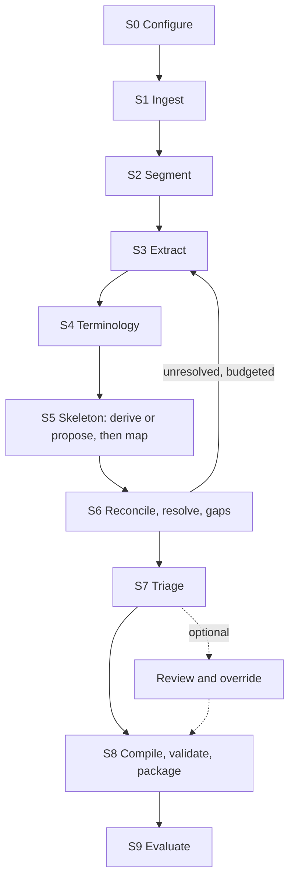

<!-- Generated by scripts/spec_tools.py from spec-src/formalisation-engine-spec.md. Do not edit; change the source spec and run `python3 scripts/spec_tools.py build`. -->

## 3. Pipeline

| Stage | Outputs | Method | Exit gate |
|---|---|---|---|
| S0 Configure | Validated configuration, run ID | Deterministic | Config valid |
| S1 Ingest | Snapshot with manifest and licence classes; document model | Deterministic | Every file parsed, referenced or rejected with a reason |
| S2 Segment | Passages with anchors and context | Deterministic | Every anchor resolves once |
| S3 Extract | Propositions | LLM structured output, deterministic guards | Every kept span verified |
| S4 Terminology | Concepts, aliases, resolved slots | Deterministic candidates, LLM resolution | Unresolved slots flagged |
| S5 Skeleton | Skeleton, skeleton relations, proposed fact types and providers | Structure plus LLM proposal and classification | Every proposition mapped or `no_relation`; coverage reported |
| S6 Reconcile | Relations, resolved conflicts, alternatives, gaps | Blocking, LLM classification, panel, policy | Every pair classified; every conflict resolved or marked |
| S7 Triage | Triage state per record | Thresholds | Every record triaged |
| S8 Compile | IR, rules, judgement procedures, package, index, validation report | Deterministic; NetworkX, Z3; narrow critic | No blocking failure; contract test passes |
| S9 Evaluate | Evaluation report | Metrics, scripted caller | Report produced |

Every stage reads and writes only through the stores, records a report (counts, failures with reasons, cost, gate), and is idempotent. Runs replay from the LLM cache and resume from the last completed stage.

---
