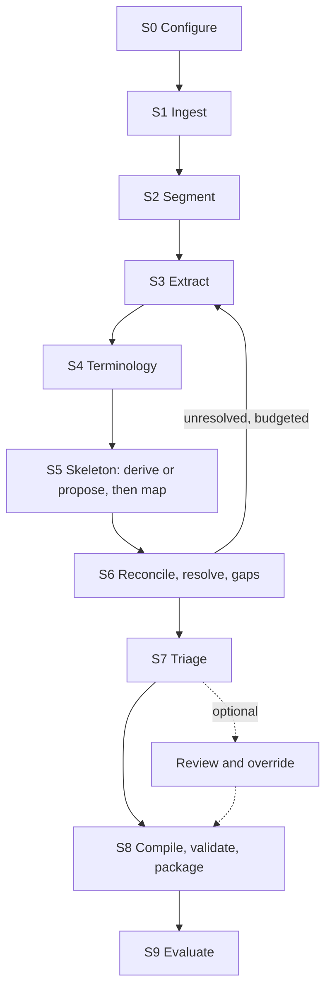

# Formalisation Engine

## Technical Specification

| Field | Value |
|---|---|
| Status | Draft 1.0 |
| Date | 18 September 2026 |
| Owner | Tom, IPAVentures |
| Readers | Claude Code instances building the system; Tom as orchestrator |

---

## 1. Introduction

### 1.1 What the Engine is

Put trustworthy source documents for one domain in at one end. Get out:

1. a **tool package**: rules as code that a specialist agent calls;
2. the **IR** it was compiled from, with every rule traceable to its passage and every conflict, gap, confidence and decision recorded as data;
3. a **retrieval index** over the same sources for the agent's squire.

The pipeline runs end to end without a person. LLMs interpret text and make judgements; deterministic code checks, stores, links, compiles and runs. Where a rule needs judgement, the compiled tool decides with an LLM at run time, records it, and accepts overrides. Human review is optional, exception-based, and can override anything. Outputs are best-effort approximations of expert practice with status attached to every claim.

Two reconstruction modes: **backbone-led** (one document describes the process; the rest elaborate it) and **framework-led** (no document does; the Engine proposes a framework of objectives, decision points, method families and checks, and the corpus populates it).

### 1.2 Where it fits

The Engine builds tools for a council of specialist agents (LangGraph) that plan and justify work carried out by builder agents. The agent, its prompt and its graph are built elsewhere; this repository ends at the package.

| Agent | Sources | Tool |
|---|---|---|
| UX-Designer (pilot) | Style Manual; WCAG 2.2 and ACT rules | WCAG conformance and Style Manual checker |
| Data-Analyst | Statistical learning texts, methodology papers | Objective and dataset characteristics to permissible methods, transformations, models, validation |
| Security-Architect | OWASP, OpenCRE, PSPF, ISM, Essential Eight | Control selection; conflicts resolve ASD principles, then Australian, then international |
| Solution-Architect | AGA, IBM well-architected, AWS decision guides | Architecture decisions |

### 1.3 Scope

**In:** the pilot domain in framework-led mode (backbone-led tested on a synthetic corpus); HTML, Markdown, text, DOCX, PDF and pinned repositories; the IR in JSON and SQLite; a three-valued reference evaluator; Engine-proposed skeleton, fact schema and providers; probes; run-time judgement; policy-based conflict resolution; triage with optional review; the package as a Python callable, MCP server and CLI over one contract; a scripted-caller harness.

**Out:** wiring the tool into any agent; OCR, diagrams, email, spreadsheets as sources; exports to other formats or rule languages; a GUI (after the pilot, if the CLI proves insufficient); governance and approval processes (outside the repository).

### 1.4 Design principles

| ID | Principle |
|---|---|
| DP-01 | Deterministic where possible, inference where required. Deterministic checks gate every LLM output; human confirmation never blocks. |
| DP-02 | Propositions with verified spans are the unit of truth. |
| DP-03 | The IR is canonical; rules, procedures, packages and indexes are compiled from it. |
| DP-04 | Loud, not fatal. A failed record is recorded and the run continues; only a configuration or environment failure stops a run. Nothing is skipped silently. |
| DP-05 | Status travels with every claim: UNKNOWN, provisional, inferred, judged, overridden. |
| DP-06 | Classify, don't generate: fixed label sets against retrieved candidates. |
| DP-07 | Stages with fixed contracts; loops have budgets. |
| DP-08 | Judgement is automated at run time, recorded with rationale and confidence, and overridable. |
| DP-09 | Everything is versioned in git. |
| DP-10 | Conflicts resolve by declared policy, logged with inputs and emitting a hook. No policy means alternatives returned unresolved. |
| DP-11 | The tool contract is fixed first and shared by every domain. |

### 1.5 Glossary

| Term | Meaning |
|---|---|
| Skeleton | The structure a domain is organised by: derived from the backbone, or proposed by the Engine as objectives, decision points, method families and checks. Elements assert nothing of their own. |
| Proposition | One structured statement from a passage: normative force, slots, conditions, verbatim span. |
| Evaluative judgement | A proposition that facts alone cannot decide ("clear", "reasonable"). Compiles to a judgement procedure the tool runs with an LLM. |
| Fact type | A typed input rules depend on, with an ordered list of providers: `probe`, `caller`, `inferred`, `derived`. |
| Probe | A deterministic function that computes fact types from an artefact or abstains with a reason. |
| Decision policy | A domain's declared way to resolve conflicts and alternatives: authority order, risk matrix or conservatism. |
| Triage | Per-record state: `auto_approved`, `provisional` (usable, uncertainty attached), `queued` (still compiled, worth a look), `blocked` (invariant failed). |
| Licence class | `store`, `reference` (fetched at run time, never committed), `excluded`. |

### 1.6 Conventions

MUST, SHOULD, MAY as in RFC 2119. Priority **M** must, **S** should, **C** could, **W** not in the pilot. Verification **T** test, **I** inspection, **D** demonstration, **A** analysis. IDs are never reused.

---

## 2. Roles

| Role | Who | Does |
|---|---|---|
| Orchestrator | Tom | Chooses domains, sources and policies; reviews when he chooses; subject matter expert for the pilot. |
| Knowledge engineer | Claude Code instances | Build the Engine; propose and maintain each domain's configuration, skeleton, fact schema, providers and probes. |
| Consuming agent | A council agent | Calls the package, supplies caller facts, accepts or overrides judgements. |
| Squire | The agent's subagent | Searches the retrieval index. |

Stack: Python, git, SQLite, Parquet, GitHub Actions; Anthropic API behind a provider abstraction; Langfuse for evaluation. Reuses the Octavius rulebook pipeline, manual-XtrACTor snapshots and the Tripwire change-detection pattern. Constraints: one developer plus Claude Code; LLM cost capped by configuration; some later sources are subscription-only.

---

## 3. Pipeline



| Stage | Outputs | Method | Exit gate |
|---|---|---|---|
| S0 Configure | Validated configuration, run ID | Deterministic | Config valid |
| S1 Ingest | Snapshot with manifest and licence classes; document model | Deterministic | Every file parsed, referenced or rejected with a reason |
| S2 Segment | Passages with anchors and context | Deterministic | Every anchor resolves once |
| S3 Extract | Propositions | LLM structured output, deterministic guards | Every kept span verified |
| S4 Terminology | Concepts, aliases, resolved slots | Deterministic candidates, LLM resolution | Unresolved slots flagged |
| S5 Skeleton | Skeleton, skeleton relations, proposed fact types and providers | Structure plus LLM proposal and classification | Every proposition mapped or `no_relation`; coverage reported |
| S6 Reconcile | Relations, resolved conflicts, alternatives, gaps | Blocking, LLM classification, panel, policy | Every pair classified; every conflict resolved or marked |
| S7 Triage | Triage state per record | Thresholds | Every record triaged |
| S8 Compile | IR, rules, judgement procedures, package, index, validation report | Deterministic; NetworkX, Z3; narrow critic | No blocking failure; contract test passes |
| S9 Evaluate | Evaluation report | Metrics, scripted caller | Report produced |

Every stage reads and writes only through the stores, records a report (counts, failures with reasons, cost, gate), and is idempotent. Runs replay from the LLM cache and resume from the last completed stage.

---

## 4. Data model

Pydantic models in one module; JSON Schema generated from them. Field lists are minimums.

**Identifiers.** Type-prefixed (`DOC`, `PAS`, `PROP`, `CON`, `EL`, `RULE`, `JDG`, `FACT`, `PRB`, `CFL`, `GAP`, `POL`, `REV`). Passage and proposition IDs are content hashes so re-runs yield the same ID for the same content. The IR carries `schema_version`, `run_id`, `snapshot_id`, `config_hash`, `policy_hash`, `prompt_set_version`.

**Document and passage.** Document: type, authority level, source kind and ref, content hash, licence class, effective dates, parse status. Passage: anchor (section, paragraph, list path, table cell, page), heading path, passage type (body, list item, table cell, note, example, definition, test rule), text and offsets, cross-references, definitions in scope.

**Proposition.** `span` (verified verbatim), `normative_force` and cue (Appendix B), slots `actor`, `action`, `object`, `authority_holder` (raw text, concept, resolution status), `conditions` (fact type, operator, value, negated), `exceptions_referenced`, `temporal` (current, historical, scheduled, superseded, unknown; dates; deadlines), `extraction` (model, prompt version, request hash), `epistemic`, `triage`.

**Skeleton element.** `kind` (objective, step, decision_point, requirement_group, method_family, method, check, judgement), parent, label, question, `selection_facts`, `expected_sources`, `origin` (derived, proposed, edited), `status`, citing passages. Asserts nothing of its own.

**Relations.** Proposition to element (Appendix C.1 or C.3); proposition to proposition (C.2). Each with rationale, method (deterministic, llm, panel, human), epistemic status.

**Rule.** `rule_set_id`, `conditions` (AND, OR, NOT), `conclusion`, `defeats` with `priority_basis` (exception, specific_over_general, later_over_earlier, higher_authority, policy, reviewer), `alternatives_set` (nullable), `source_propositions`, `temporal`, `triage`, `executability` (executable, frozen with reason).

**Judgement procedure.** `question`, `considerations` (each sourced), `inputs`, versioned `prompt_template`, `output_schema` (outcome, rationale, confidence), `cost_class`, `cache_by` (artefact hash, inputs, prompt version).

**Fact type.** `data_type`, `allowed_values`, `closed_world` (default false), `providers` (ordered: `probe`, `caller`, `inferred`, `derived`), `probe_id`, `allow_inference`, `artefact_kind`, `obtained_from`, `origin`. **Probe.** `computes`, `artefact_kind`, `preconditions`, `cost` (trivial, cheap, expensive), `abstain_reasons`, implementation and version.

**Epistemic status.** `extraction_confidence`, `interpretation_confidence` (never an LLM probability alone), `source_authority`, `consistency` (consistent, qualified, resolved_by_policy, alternatives, conflicted), `provenance_kind` (extracted, inferred, judged, derived, overridden), `triage`, and `overall` as a deterministic function of the rest.

**Conflict.** propositions, kind, `resolution` (policy ID, inputs, decision, rationale, decided by: policy, panel, reviewer, unresolved), `alternatives` (members with name, conditions, sources), status. **Gap.** kind (missing fact source, missing threshold, missing outcome, missing definition, empty element, unreachable branch, dangling reference), target, `search_record` (queries, methods, candidates, verdicts), status. A gap says what was searched and not found, never that the information does not exist.

**Decision policy.** `scope` (conflicts, alternatives, judgement_defaults), `kind` (authority_order, risk_matrix, conservative), `definition`, `applies_when`, `hooks`. Every invocation writes policy, inputs, decision and rationale to the append-only decision log.

**Authority profile.** Ordered levels with document types, equal-rank declarations, and `resolves_conflicts` (true makes rank a policy; false makes it descriptive).

**Review decision and override.** target, decision (approve, reject, modify, override, defer), field-level changes, rationale, decided by (person or caller). Overrides beat automated decisions and are re-applied on re-runs while the record is unchanged.

**Tool package.** `ir_version`, `snapshot_id`, `contract_version`, objectives, rules, judgement procedures, evidence requirements, providers, policies, citations (document, anchor, quotation within licence), limits, status counts, index reference.

---

## 5. Functional requirements

### 5.1 Configuration and ingestion (FR-CFG, FR-ING)

| ID | Requirement | Pri | Ver |
|---|---|---|---|
| FR-CFG-01 | One versioned `domain_config.yaml` per domain: corpus kind, mode, consuming agent, sources with licence classes, backbone or skeleton origin, authority profile, decision policies, fact schema, providers, vocabulary, models, cost caps, loop budgets, triage thresholds. Validated before any stage runs; an invalid field is named; backbone-led needs exactly one backbone, framework-led none; every fact type used exists and every probe provider is registered. | M | T |
| FR-CFG-02 | Skeleton, fact schema, providers and policies are files the Engine proposes and a person may edit. Files marked `origin: edited` are only ever re-proposed as a recorded diff. | M | T |
| FR-CFG-03 | Every run records the hash of every configuration, policy and prompt file used. Prompts are versioned template files, never inline. | M | T |
| FR-ING-01 | Ingest HTML, Markdown, text, DOCX, digitally generated PDF, pinned repositories (remote, commit, patterns) and existing snapshots. Every ingest produces an immutable snapshot with a manifest (file, URI, time, SHA-256, licence class). | M | T |
| FR-ING-02 | Parsing preserves structure (headings, numbered sections, lists, tables, notes, examples, pages). Source text is recoverable from anchor and offsets. Machine-readable rules published beside prose (ACT rules) are ingested as structured records linked to their passages. | M | T |
| FR-ING-03 | A file that cannot be parsed is recorded `rejected` with a reason and the run continues unless the file is `required`. | M | T |
| FR-ING-04 | A `reference` source is fetched at run time and never written as text; URI, hash, anchors and quotations within its licence note are kept. An `excluded` source is never fetched. | M | T |

### 5.2 Segmentation and extraction (FR-SEG, FR-EXT)

| ID | Requirement | Pri | Ver |
|---|---|---|---|
| FR-SEG-01 | Segment on structure, never token windows. Every passage has an anchor resolving to exactly one location, its heading path and parent. Long passages split at sentence boundaries under a shared parent, recorded. Definition blocks are indexed; cross-references detected and resolved where possible. | M | T |
| FR-EXT-01 | One passage per request with heading path, parent text and definitions in scope; nothing from other documents. Structured output validated against a schema, retried to a limit, then recorded as failed. A passage with zero propositions records why. | M | T |
| FR-EXT-02 | Every proposition carries a verbatim span verified by exact match; a mismatch rejects the proposition and is logged. | M | T |
| FR-EXT-03 | Every proposition gets a normative force from Appendix B with its cue. A deterministic modal-cue detector classifies independently; disagreement sets extraction confidence low. Open-textured standards (configurable cues) are EVALUATIVE_JUDGEMENT whatever the modal verb. | M | T |
| FR-EXT-04 | Conditions and exceptions are captured as structure. A guard checks that a span with a condition cue yields a condition or exception. Notes and examples are EXPLANATORY or EXAMPLE. Temporal expressions are captured. | M | T |
| FR-EXT-05 | LLM requests and responses are cached by request hash so runs replay without API calls. Bulk work uses the Batch API with a submit and collect split. | M | T |

### 5.3 Terminology and retrieval (FR-VOC, FR-RET)

| ID | Requirement | Pri | Ver |
|---|---|---|---|
| FR-VOC-01 | Slots resolve to concepts: deterministic candidates (exact, normalised, lemma, embedding above threshold), then LLM resolution with rationale. Above the domain threshold the resolution is confirmed and recorded as confirmed by the Engine; below it, flagged. New concepts and merges are recorded the same way. Every alias records the documents using it. | M | T |
| FR-VOC-02 | Differing definitions of one term raise a terminology conflict resolved under the decision policy; the highest-ranked source wins by default. | M | T |
| FR-RET-01 | Hybrid retrieval: SQLite FTS5 plus embeddings fused by reciprocal rank, with filters (document, authority, temporal, force, concept, element) and alias expansion. Every call is logged so a gap can cite it. | M | T |
| FR-RET-02 | The index is exportable as a retrieval package for the squire, with the same filters. | S | T |

### 5.4 Skeleton and mapping (FR-SKL, FR-MAP)

| ID | Requirement | Pri | Ver |
|---|---|---|---|
| FR-SKL-01 | Backbone-led: derive the skeleton from the backbone's propositions (steps, decisions, judgement points), each linked to its sources. | M | T |
| FR-SKL-02 | Framework-led: propose the skeleton from document structure (criteria, headings, numbered guidance) and clusters of propositions sharing concepts, using the fixed element kinds. Every element cites the passages that suggested it. | M | T |
| FR-SKL-03 | Propose fact types from proposition conditions (clustered by concept and operator, typed by value) and providers: a registered probe where artefact kind and fact match, else `caller`, with `inferred` where the fact is readable from the artefact. Proposals are written to the domain files with `origin: proposed`. | M | T |
| FR-SKL-04 | Produce a coverage report: per element, mapped propositions by force and source, empty elements first. Empty elements raise gaps. | M | T |
| FR-MAP-01 | Classify each proposition against retrieved elements using the fixed label set (Appendix C.1 or C.3) or `no_relation`, with a rationale. No free-form restructuring. Structural types go to triage. | M | T |
| FR-MAP-02 | Report the `no_relation` rate; above the configured threshold, re-propose the skeleton for the affected propositions once. | M | T |

### 5.5 Reconciliation, conflicts and gaps (FR-REC, FR-CFL, FR-GAP)

| ID | Requirement | Pri | Ver |
|---|---|---|---|
| FR-REC-01 | Candidate pairs come from blocking on canonical keys and resolved cross-references, never all pairs; coverage reported. Each pair is classified into a type from Appendix C.2 or `unrelated`, considering EXCEPTS, QUALIFIES, SUPERSEDES, ELABORATES and ALTERNATIVES before CONTRADICTS. | M | T |
| FR-CFL-01 | Numeric, date, responsibility and sequence conflicts are detected deterministically. A CONTRADICTS pair goes to a panel of at least two independent classifications; any confirming vote raises a conflict and disagreement is recorded. | M | T |
| FR-CFL-02 | Every conflict is resolved by the domain's decision policy where one applies. The invocation writes policy, inputs, decision and rationale to the decision log and emits the policy's hook. | M | T |
| FR-CFL-03 | Where no policy applies, the conflict is recorded as alternatives (name, propositions, conditions, sources). Rules from an alternatives set compile as mutually exclusive guarded options with no defeat between them; at run time the tool applies the applicable policy or returns the options with conditions. Nothing is silently chosen. | M | T |
| FR-CFL-04 | A reviewer or caller can override any resolution; the override is recorded and wins on re-runs while inputs are unchanged. The register is exportable with citations and policies applied. | M | T |
| FR-GAP-01 | Detect structural gaps (decisions without a rule or procedure, outcomes without edges, fact types without a provider, undefined facts, unresolved references, empty elements). Each triggers a targeted search recorded in the gap; candidates pass through extraction and mapping. Per-gap and per-run budgets; when spent, the gap stays unresolved. | M | T |
| FR-GAP-02 | Gaps remain in the IR, appear in the package as limits, and make dependent decisions return UNKNOWN. | M | T |

### 5.6 Temporal, authority, status and triage (FR-TMP, FR-AUT, FR-EPI, FR-TRI)

| ID | Requirement | Pri | Ver |
|---|---|---|---|
| FR-TMP-01 | Every proposition, rule and node carries a temporal status with its basis. Only `current` compiles as executable by default; `unknown` compiles as provisional. Evaluation accepts an "as at" date. Deadlines are structured durations with an anchor event. | M | T |
| FR-AUT-01 | Every document has an authority level from the profile. Rank resolves conflicts only where the profile declares `resolves_conflicts: true`; equal-ranked levels never resolve by rank. In policy corpora, decisions without an authority holder raise a gap. | M | T |
| FR-EPI-01 | Every record carries an epistemic status whose `overall` is a deterministic, unit-tested function of the dimensions. LLM self-reported confidence is never the sole input. Status propagates: a rule takes the weakest status of its sources unless overridden. | M | T |
| FR-TRI-01 | Every record is triaged by configured thresholds: `auto_approved`, `provisional`, `queued`, or `blocked` only when an invariant fails. Queued records still compile as provisional; blocked ones do not and appear as limits. Counts by state and reason are reported per run. | M | T |
| FR-TRI-02 | Reviews and overrides take precedence over triage and are re-applied on re-runs while the record is unchanged; a changed record returns to the queue with a diff. | M | T |

### 5.7 Compilation and validation (FR-CMP, FR-VAL)

| ID | Requirement | Pri | Ver |
|---|---|---|---|
| FR-CMP-01 | MUST, MUST_NOT, MAY and DEFINITIONAL compile to rules (DEFINITIONAL to fact derivations); SHOULD to advisory notes; EVALUATIVE_JUDGEMENT to a judgement procedure; EXPLANATORY, EXAMPLE and UNRESOLVED never; CAN and DESCRIPTIVE only when marked operative. Every rule references a source proposition and carries its triage state. Blocked propositions never compile. | M | T |
| FR-CMP-02 | Exceptions compile as defeat relations, never rewritten conditions. A rule depending on an unresolved gap, unresolved condition or blocked source is frozen with a reason. A condition with no fact type gets a proposed one and the rule is provisional until confirmed. | M | T |
| FR-CMP-03 | Package, retrieval index and rule set are built from the same IR in the same run. | M | T |
| FR-VAL-01 | Graph checks (NetworkX): unreachable nodes, dead ends, outcomes without edges, unintended cycles, orphaned exceptions, circular dependencies. Solver checks (Z3): unsatisfiable conditions, overlapping contradictory rules without defeat or alternatives, unreachable exceptions. Every fact type used has a provider. | M | T |
| FR-VAL-02 | An LLM critic checks each rule for two things only: guidance treated as binding, and a rule beyond its sources. Findings lower the rule to provisional and queue it. | M | T |
| FR-VAL-03 | Failures are blocking or warning; blocking stops publication of the affected rule set, not the run. The contract test (Appendix E) passes before a package is published. | M | T |

### 5.8 Evaluation, judgement and probes (FR-QRY, FR-JDG, FR-PRB)

| ID | Requirement | Pri | Ver |
|---|---|---|---|
| FR-QRY-01 | Three-valued logic. A missing fact is UNKNOWN unless its type is `closed_world`; no negation as failure on open-world facts. An UNKNOWN result lists the fact types that would resolve it and how to obtain each. | M | T |
| FR-QRY-02 | Applicability query: given an objective and known facts, return rules that apply, rules that would apply if a fact were settled, judgement procedures reached, alternatives reached. | M | T |
| FR-QRY-03 | Facts carry provenance (`probe`, `caller`, `inferred`, `derived`, `override`) and confidence. Every result explains: rules fired, defeated and by what, policies invoked, judgements made, facts used, citations. | M | T |
| FR-QRY-04 | The evaluator is pure and deterministic for the same IR, facts, policies and date, and accepts an "as at" date. Judgement and inference happen outside it and enter as tagged facts. | M | T |
| FR-JDG-01 | A judgement procedure runs only when rules cannot decide and no override exists, through the provider abstraction with its versioned prompt. Outcome, rationale, confidence, model, prompt version, inputs and artefact hash are logged; the result is returned tagged `judged`. | M | T |
| FR-JDG-02 | A fact is inferred from the artefact only where its type allows it and no probe or caller value exists, with confidence, reported as `inferred`. | M | T |
| FR-JDG-03 | Judgements and inferences cache by artefact hash, inputs and prompt version. Cost is capped per call and per package; at the cap the result is UNKNOWN with `budget_exhausted`. `no_inference` mode returns the policy default or UNKNOWN. | M | T |
| FR-JDG-04 | Any judgement or inferred fact can be overridden by a caller or reviewer with provenance `override`; overrides are logged and win. | M | T |
| FR-PRB-01 | A probe is deterministic and read-only: same content, same result; no scripts executed, no links followed, no LLM calls. It returns a value with the artefact reference or UNKNOWN with a declared abstain reason, never a default or estimate. Preconditions are checked first. | M | T |
| FR-PRB-02 | Every result records probe ID, version, artefact hash and duration, and caches by artefact hash and version. Abstentions reach the response as reasons, never nulls. Expensive probes are opt-in. | M | T |
| FR-PRB-03 | The registry is introspectable and accepts probes from a domain without core changes. Every probe has a value test and an abstention test. | M | T |

### 5.9 Tool package (FR-TOO)

| ID | Requirement | Pri | Ver |
|---|---|---|---|
| FR-TOO-01 | One package per domain and IR version, callable as a Python function, an MCP server and a CLI over the contract in Appendix E, recording `ir_version`, `snapshot_id` and `contract_version`. | M | T |
| FR-TOO-02 | A response contains: rules that apply with status and citations; undetermined items with the facts needed and how to obtain each; judgements with rationale and confidence; policy decisions with policy and inputs; unresolved alternatives with conditions; limits; status counts; and the best-effort note. Provisional, inferred, judged and overridden content is distinguishable from verified content. | M | T |
| FR-TOO-03 | Every assertion cites a passage in the snapshot. An unknown objective is refused with the supported list; a package whose IR version does not match refuses. The tool adds nothing the IR does not contain. | M | T |
| FR-TOO-04 | The tool accepts caller facts and overrides, runs providers in order, honours `mode: plan`, `no_inference` and `max_probe_cost`, and never blocks on a person: a missing caller fact is undetermined with what is needed. | M | T |
| FR-TOO-05 | Run-time decision log entries go to a caller-configurable sink in the pipeline's schema. The package runs offline against recorded artefacts and the replay cache. | M | T |

### 5.10 Review, provenance, change, operations, evaluation (FR-REV, FR-PRV, FR-CHG, FR-OPS, FR-EVL)

| ID | Requirement | Pri | Ver |
|---|---|---|---|
| FR-REV-01 | A local review interface lists queued items in triage order with spans in context, rationale, policy decisions and status, and allows approve, reject, modify, override and defer (rationale required for reject, modify, override). Decisions go to the decision log and git and win over automation. Reviewers never read JSON. | M | D |
| FR-PRV-01 | Every rule, procedure, policy decision and assertion traces to propositions, passages, document versions, snapshot and any override. A trace command prints the chain for any ID; a reverse trace lists dependants of any passage. Every LLM-derived field records model, prompt version and request hash. | M | T |
| FR-CHG-01 | A new snapshot produces a passage-level diff, marks dependants `stale`, freezes stale rules until reprocessed, re-applies overrides on unchanged records, and produces an impact report. Incremental runs reprocess only changed passages and dependants. | M | T |
| FR-OPS-01 | CLI commands for each stage, full run, replay run, incremental run, build package, build index, trace. Each stage writes a report (counts, failures with reasons, cost, duration, gate); each run a Markdown summary. Runs resume from the last completed stage. | M | T |
| FR-EVL-01 | A gold IR in the same schema, with fact sets and expected outcomes including UNKNOWN, and a question set with gold answers, citations and an unanswerable subset. The harness aligns generated and gold records, computes the metrics in 7.2, and runs the gates in 7.3. | M | T |
| FR-EVL-02 | The tool harness calls the package with a scripted caller over answerable, conditional and unanswerable questions, scoring answer quality, citation validity, correct abstention and unsupported claims. Results log to Langfuse. | M | T |

---

## 6. Non-functional requirements

| ID | Requirement | Pri | Ver |
|---|---|---|---|
| NFR-SAF-01 | No rule, procedure or assertion exists without a source proposition with a verified span. Invariants (Appendix D) are checked on every IR write; a violation blocks the record, not the run. | M | T |
| NFR-SAF-02 | Source text and artefacts are data: prompts delimit them, outputs are schema-constrained, probes never execute content. Only the `inferred` provider and judgement procedures use inference, and both tag their output. | M | T |
| NFR-TRC-01 | 100% of propositions have verified spans; 100% of rules, procedures, conflicts, gaps and assertions resolve to passages. Snapshots, configuration, prompts, schemas, policies, decisions and packages are committed and tagged. | M | T |
| NFR-DET-01 | Deterministic stages are byte-identical for identical input. Any run, and any tool call, replays from cache with identical output including judgements. Dependencies are pinned. | M | T |
| NFR-REL-01 | No silent skips; every failure is in the report. Stages are idempotent, writes atomic, runs resumable. Transient API errors retry with backoff to a limit. | M | T |
| NFR-PRF-01 | A full pilot run (15 documents, about 3,000 passages) completes in under 60 minutes on a GitHub-hosted runner excluding batch waits; a replay run in under 15. A tool call with cheap probes and cached judgements returns in under 3 seconds. | S | T |
| NFR-CST-01 | Every run and every tool call has a configurable cost ceiling; cost is estimated before submission and reported per stage and model. Unchanged passages are never re-sent. | M | T |
| NFR-SEC-01 | Secrets in environment variables or CI secrets, never in the repository; secret scan and dependency scan in CI. Review interface and MCP server bind locally by default. | M | T |
| NFR-MNT-01 | Python 3.12, mypy strict, ruff, Pydantic models defined once with generated JSON Schema. Stages talk only through store interfaces. Probes, policies and compile targets are pluggable. `CLAUDE.md` kept current. | M | I |
| NFR-TST-01 | Deterministic code at least 85% covered. Property-based tests for truth tables, defeat ordering and UNKNOWN propagation. A seeded-defect test per validation check, an abstention test per probe, a replay test per judgement procedure, a test per policy level or cell. | M | T |
| NFR-PRT-01 | LLM access through a provider abstraction with model IDs in configuration; a model change triggers re-evaluation. The IR depends on no compile target. The contract is shared; a domain adds fields only inside declared extension points. | M | T |
| NFR-EXT-01 | Onboarding a domain needs only configuration, sources and policies. No core code, IR schema or contract change. | M | D |
| NFR-INT-01 | IR schema and contract schema published per version; ISO 8601 dates; UTF-8; IDs convertible to IRIs. The Python callable is typed and usable as a LangGraph tool without adapters; MCP exposes the same operations. | M | T |
| NFR-OBS-01 | JSON-lines logs with run, stage and record IDs; every LLM call, judgement and policy invocation traced in Langfuse with cost; triage counts in the run summary. | S | I |

---

## 7. Evaluation and acceptance

### 7.1 Gold standard

Built with the orchestrator for the pilot objective before extraction exists: normative propositions with force and slots, their elements, rules, expected judgement points and alternatives, conflicts and gaps, fact sets with outcomes including UNKNOWN, and a question set with gold answers, citations and an unanswerable subset. Versioned with its snapshot.

### 7.2 Metrics

| Metric | Target |
|---|---|
| Span validity | 100% |
| Proposition recall, precision, force accuracy | 0.90, 0.85, 0.90 |
| Judgement point recall; condition and exception capture | 0.90 |
| Skeleton element F1; relation macro-F1; element coverage | 0.75; 0.75; 100% |
| Conflict recall; policy resolution correctness | 0.90; 100% |
| Invented content (rules with no support in sources) | 0 |
| Rule behaviour on gold fact sets | 100% |
| Probe correctness and abstention | 1.00 (a wrong value is a defect) |
| Judgement agreement with gold, by confidence band | 0.80 |
| Citation resolution; sampled citation support | 1.00; 0.95 |
| Correct abstention on unanswerable questions; unsupported claims | 0.95; 0 |
| Auto-approval, provisional, queued and blocked rates; review minutes per item; cost per run and per call | Report |

### 7.3 Gates

| ID | Test | Pass condition |
|---|---|---|
| G1 | **Abstention by deletion.** Remove the only source for an element; re-run. | Gap raised; dependent rules frozen; tool returns UNKNOWN with the gap; nothing invented. |
| G2 | **Tool asks for what it needs.** Call an objective with no facts and no artefact. | Undetermined items list the facts and how to obtain each. |
| G3 | **Guidance not promoted.** Add a "should" restatement of a requirement. | No executable obligation derives from it; it is advisory. |
| G4 | **Conflict by policy.** Seed a threshold conflict with an authority-order policy, then without one. | Resolved and logged with policy and inputs, hook emitted; then recorded as alternatives and returned with conditions, nothing chosen. |
| G5 | **Change resilience.** Amend one passage in a new snapshot. | Only dependants go stale; overrides on unchanged records survive. |
| G6 | **Fabricated provenance and injection.** Inject a cached response whose span is not in the source; put instruction-like text in a passage and an artefact. | Proposition rejected and logged; pipeline and probes unchanged. |
| G7 | **Judgement at run time.** Call an objective that reaches a judgement point. | Outcome tagged `judged` with rationale and confidence, logged; a caller override replaces it on the next call and shows as `overridden`. |
| G8 | **Replay.** Replay a run and a tool call from cache. | Identical outputs, including judgements. |
| G9 | **Exception precedence.** A rule and its exception both apply; then the exception's fact is UNKNOWN. | Exception wins, defeat shown; then UNKNOWN with the exception's facts listed. |
| G10 | **Probe abstains.** Run every probe on a malformed artefact. | UNKNOWN with a declared reason, carried into the response; no value invented. |
| G11 | **Reference source.** Configure a `reference` source. | No text stored; citations give anchor and link. |
| G12 | **Provisional carries status.** Lower a rule below the auto-approval threshold. | It still compiles and answers, tagged provisional, and is queued. |

### 7.4 Acceptance

Every M requirement verified; all gates pass; metrics meet targets or each shortfall has a plan; the orchestrator's assessment of the tool's answers is complete; a short report covers effort, cost, results and the next domain.

---

## 8. Delivery plan

| Milestone | Scope | Exit |
|---|---|---|
| M0 Contract and models | Confirm pilot objective. Fix the contract (Appendix E). IR models, schema, invariants. Policy format. Start the gold slice. | Contract and schema committed; models validate; gold slice drafted. |
| M1 Thin slice | Hand-build an IR for one objective (10 to 20 rules, a judgement point, an alternatives set, a policy). Reference evaluator. Compile the package. Scripted harness. | G2, G7, G9 pass; harness answers with citations and abstains correctly. Go or no-go on the contract. |
| M2 Ingest and extract | S0 to S3. Licence classes, repositories, provider abstraction, cache, batch, guards. Extraction metrics. | G6, G11 pass; metrics measured. Go or no-go on extraction quality. |
| M3 Vocabulary and skeleton | S4, S5. Retrieval. Skeleton, fact type and provider proposal. Coverage report. | Skeleton and relation metrics measured; proposals written to domain files. |
| M4 Reconcile, resolve, triage | S6, S7. Blocking, panel, policies, alternatives, gaps, triage, decision log, review interface. | G4, G12 pass. |
| M5 Probes, judgement, compile | Probe registry, judgement procedures, S8 in full, validation, contract test, retrieval package. | G1, G3, G8, G10 pass; the generated package replaces the hand-built one under the same contract. |
| M6 Change and evaluation | Change management, full evaluation, report, next-domain recommendation. | G5 passes; 7.4 met. |

M1 tests the contract while it is cheap to change. M2 tests whether extraction is good enough to carry the rest.

---

## 9. Risks and open questions

| ID | Risk | Mitigation |
|---|---|---|
| R-01 | Auto-approved content is wrong and nobody looks | Thresholds tuned on gold; invented-content target 0; status in every response |
| R-02 | Proposed skeleton fits the corpus badly | Elements cite passages; coverage and `no_relation` rates drive re-proposal; element F1 measured |
| R-03 | A wrong probe poisons every rule using it | Probe correctness is a defect class; artefact hash on every value |
| R-04 | Run-time judgements are confidently wrong | Rationale and confidence returned; agreement measured by band; overrides win |
| R-05 | The contract changes late | Fixed in M0, tested in M1 on a hand-built slice |
| R-06 | Scope creep into agents, exports, GUI | Out-of-scope list; W priorities |

| ID | Question | Proposed approach |
|---|---|---|
| OQ-01 | M1 objective and pilot policy | Page structure and headings; risk matrix over user impact and effort, serving the stricter requirement unless impact is low and effort high. |
| OQ-02 | Triage thresholds | Auto-approve when guards agree, confidence high, no open conflict, temporal current. Tune on gold in M4. |
| OQ-03 | Judgement model and caps | Cheapest model meeting 0.80 agreement; measure in M5. |
| OQ-04 | Where inference stops | Only facts readable from the artefact; never facts about the caller's context. Set per fact type. |
| OQ-05 | Next domain | Data-Analyst, then Security-Architect. Decide after M6. |

---

## Appendix A. Worked example

Fictional. A page is checked for heading structure. A standard says headings must describe the section that follows; a style guide says headings must not skip levels and should be short. The sources are equal-ranked; the policy is "serve the stricter requirement, record the choice".

Propositions: two MUST (describe section; do not skip levels), one SHOULD (short). "Describes the section" is EVALUATIVE_JUDGEMENT and compiles to a judgement procedure. Fact types: `heading_levels_skipped` (probe), `heading_describes_section` (caller, then inferred).

Call with objective `page-structure`, an HTML artefact, no facts:

| Element | Content |
|---|---|
| `applies` | Skip-levels rule `not_satisfied`, probe value 1, cited. |
| `advisory` | Short headings, cited. |
| `judgements` | "Do the headings describe their sections?" outcome `mostly`, confidence 0.7, tagged `judged`, logged. |
| `undetermined`, `policy_decisions`, `limits` | None. |
| `status_summary` | verified 1, judged 1, advisory 1. |

A second call with `heading_describes_section: false` as an override returns the override, shown as `overridden`, with both entries in the log.

---

## Appendix B. Normative force

| Force | Default cues | Compiles to |
|---|---|---|
| MUST | must, is required to, is to, shall (flag) | Rule |
| MUST_NOT | must not, is not to, may not (flag) | Rule |
| SHOULD, SHOULD_NOT | should, is expected to | Advisory |
| MAY | may, is permitted to | Permission rule; judgement procedure if it turns on an open standard |
| CAN, DESCRIPTIVE | can, generally, present-tense practice | Rule only if marked operative |
| DEFINITIONAL | means, includes, is taken to be | Fact derivation |
| EVALUATIVE_JUDGEMENT | reasonable, appropriate, clear, meaningful, describes, satisfied that | Judgement procedure |
| EXPLANATORY, EXAMPLE | purpose of, because, for example; note and example passages | Nothing |
| UNRESOLVED | guards disagree | Nothing; queued |

An open-textured standard makes the proposition EVALUATIVE_JUDGEMENT even with a modal verb (extract two propositions if the passage also imposes a clear obligation). Notes and examples inherit their passage type.

---

## Appendix C. Relation types

**C.1 Backbone (proposition to step):** `elaborates_step`, `introduces_step`, `introduces_decision`, `introduces_prerequisite`, `introduces_exception`, `introduces_alternative_pathway`, `defines_term`, `specifies_authority`, `specifies_evidence`, `modifies_rule`, `contradicts`, `establishes_dependency`, `context_only`, `no_relation`. `introduces_*` and `contradicts` are structural.

**C.2 Proposition to proposition:** SUPPORTS, ELABORATES, QUALIFIES, EXCEPTS, SUPERSEDES, ALTERNATIVES (different supportable positions on one question), CONTRADICTS (cannot both be followed and nothing else explains it), DUPLICATES, REFERENCES, DEPENDS_ON, DEFINES, IMPLEMENTED_BY.

**C.3 Framework (proposition to element):** `states_requirement`, `defines_criterion`, `provides_method`, `provides_test`, `constrains_method`, `recommends_method`, `specifies_evidence`, `defines_term`, `validates_step`, `alternative_to`, `contradicts`, `context_only`, `no_relation`. `defines_criterion`, `constrains_method`, `recommends_method`, `alternative_to` and `contradicts` are structural.

---

## Appendix D. Invariants

Checked on every IR write. A violation blocks the record, never the run.

| ID | Invariant |
|---|---|
| INV-01 | Every proposition has a verified verbatim span. |
| INV-02 | Every node, rule, judgement procedure and conflict has a source proposition; every gap has a target and a search record. |
| INV-03 | Every decision has an `unable_to_determine` outcome with an edge. |
| INV-04 | No compiled rule comes from a non-compilable force or a blocked proposition. |
| INV-05 | Every rule condition references a fact type with a provider. |
| INV-06 | Backbone-led has exactly one backbone; framework-led none. Every document has an authority level and a licence class. |
| INV-07 | Defeat relations are acyclic; members of an alternatives set never defeat each other. |
| INV-08 | Judgement nodes are decided only by their procedure or an override. |
| INV-09 | A probe result is a value with an artefact reference or UNKNOWN with a declared reason. |
| INV-10 | Every tool assertion carries a citation that resolves to a passage. |
| INV-11 | No stored text for a `reference` or `excluded` source. |
| INV-12 | Every policy invocation, judgement and override is in the decision log with its inputs, and an override beats an automated decision on an unchanged record. |

---

## Appendix E. Tool contract

Shared by every domain. `contract_version` is semantic; a breaking change updates every consumer. One implementation behind three surfaces: Python (`tool(request) -> response`, typed, usable as a LangGraph tool), MCP (`answer`, `plan`, `objectives`, `trace`), CLI (`engine-tool <package> answer request.json`).

**Request**

```json
{
  "contract_version": "1.0",
  "objective": "page-structure",
  "artefacts": [{ "kind": "html", "path": "./build/index.html", "sha256": "..." }],
  "facts": { "audience": { "value": "general_public", "source": "caller" } },
  "overrides": { "heading_describes_section": { "value": false, "source": "override", "by": "ux-designer" } },
  "options": { "mode": "answer", "no_inference": false, "max_probe_cost": "cheap", "as_at": "2026-09-18" }
}
```

**Response**

```json
{
  "contract_version": "1.0",
  "package": { "domain": "style-manual-wcag", "ir_version": "1.3.0", "snapshot_id": "SNAP-..." },
  "objective": "page-structure",
  "applies": [{ "rule_id": "RULE-...", "statement": "Heading levels must not be skipped.", "status": "not_satisfied", "state": "verified",
                "facts_used": [{ "fact_type": "heading_levels_skipped", "value": 1, "source": "probe", "probe_id": "PRB-...", "confidence": 1.0 }],
                "citations": [{ "document": "Style Manual", "anchor": "headings", "quote": "..." }] }],
  "advisory": [{ "rule_id": "RULE-...", "statement": "Headings should be short.", "citations": [] }],
  "judgements": [{ "procedure_id": "JDG-...", "question": "...", "outcome": "mostly", "rationale": "...", "confidence": 0.7,
                   "source": "judged", "model": "...", "prompt_version": 3, "citations": [] }],
  "policy_decisions": [{ "policy_id": "POL-...", "inputs": {}, "decision": "...", "rationale": "...", "hook": "policy.invoked" }],
  "undetermined": [{ "item": "RULE-...", "needs": [{ "fact_type": "...", "how_to_obtain": { "kind": "caller", "question": "..." } }] }],
  "alternatives": [{ "question": "...", "options": [{ "name": "...", "conditions": "...", "citations": [] }], "unresolved_because": "no policy applies" }],
  "limits": [{ "kind": "gap", "id": "GAP-...", "effect": "..." }],
  "status_summary": { "verified": 1, "provisional": 0, "inferred": 0, "judged": 1, "overridden": 0, "advisory": 1 },
  "note": "Best-effort approximation of the sources; status is attached to every item.",
  "plan": null
}
```

Rules: every assertion cited (INV-10); missing facts in `undetermined`, never filled by the evaluator; inferred and judged items tagged with confidence, overrides shown as `overridden`; policy decisions carry policy, inputs and rationale; limits always present; version mismatch or unknown objective is refused.
